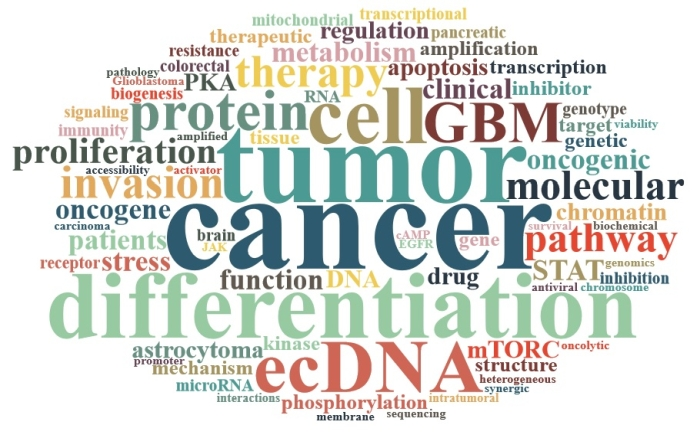
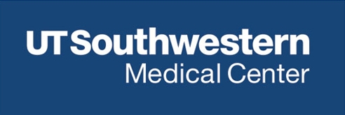
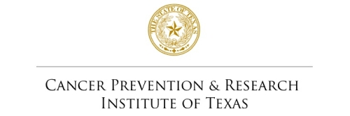

# Sihan Wu Laboratory
### Children's Medical Center Research Institute at UT Southwestern
### [:pencil2: We are hiring! Please see details below. :pencil2:](#Multiple-postdoc-positions-opening)

## Research

The 23 pairs of chromosomes are the genetic blueprint of human life, with individual genes and regulatory elements orderly mapped to each chromosome. In cancer, this blueprint is altered. One of the most common genetic alterations causing cancer is oncogene amplification. Instead of 2 copies, a cancer cell might have 10, 20, 30, or even more copies of an oncogene, promoting unrestrained proliferation. The development of high-throughput sequencing and the human genome map have been critical tools to understand the genetic changes that occur in cancer cells. However, many amplified oncogenes are not physically located where the genomic maps indicate. Instead, they are frequently amplified on **extrachromosomal DNA (ecDNA)** particles.

ecDNA was first described in cancer in 1965, but it was thought to only occur in 1.4% of cancers. Recent studies, including our research into the ecDNA landscape of clinical tumor samples, have revealed a surprisingly high prevalence of ecDNA in some human cancers, especially in aggressive cancers like those of the brain, lung, and breast. Accumulating evidence suggests that ecDNA is driving malignant behaviors in cancer cells, such as drug resistance.

Given the prevalence of ecDNA in cancer, we sought to interrogate the most fundamental question: what is the structure of ecDNA and its impact on gene regulation? By integrating a series of sequencing, imaging, and computational approaches, we have proven that ecDNA is circular with higher transcriptional activity due to its de-compacted chromatin and rewired cis-chromatin interactions, providing new insight into how circular ecDNA structure impacts oncogene function, bridging ecDNA biology with modern cancer genetics and epigenetics.

**The long-term goal of our lab is to understand the molecular functions of ecDNA, and the molecular mechanisms maintaining ecDNA in cancer.** Let’s begin with revisiting one of the most fundamental knowledge in biology, the Central Dogma, which depicts the flow of genetic information, and place ecDNA into the picture. Then we can begin to ask: How does ecDNA replicate? How does ecDNA transcribe? How is the epigenetic landscape of ecDNA altered to enable higher transcriptional activity? How does ecDNA impact the transcriptome of cancer? How does ecDNA repair upon damage? By understanding these mechanisms, we will be able to develop specific therapeutic strategies to eliminate ecDNA and target oncogenes that are otherwise undruggable, such as *MYC*.

## Selected publications
1. Wu S, Turner KM, Nguyen N, Raviram R, Erb M, et al. 2019. Circular ecDNA promotes accessible chromatin and high oncogene expression. [Nature. 575(7784):699–703](https://www.nature.com/articles/s41586-019-1763-5)
2. Kim H, Nguyen N-PP, Turner K, Wu S, Gujar AD, et al. 2020. Extrachromosomal DNA is associated with oncogene amplification and poor outcome across multiple cancers. [Nature Genetics. 52(9):891–97](https://www.nature.com/articles/s41588-020-0678-2)
3. Wu S, Bafna V, Mischel PS. 2021. Extrachromosomal DNA (ecDNA) in cancer pathogenesis. [Current Opinion in Genetics & Development. 66:78–82](https://www.sciencedirect.com/science/article/abs/pii/S0959437X21000022)
4. Bi J, Chowdhry S, Wu S, Zhang W, Masui K, Mischel PS. 2020. Altered cellular metabolism in gliomas — an emerging landscape of actionable co-dependency targets. [Nature Reviews Cancer. 20(1):57–70](https://www.nature.com/articles/s41568-019-0226-5)
5. Cai J, Liu W, Wong CW, Zhu W, Lin Y, et al. 2020. Zinc-finger antiviral protein acts as a tumor suppressor in colorectal cancer. [Oncogene. 39(37):5995–6008](https://www.nature.com/articles/s41388-020-01416-7)
6. Hung KL, Yost KE, Xie L, Wu S, Lange JT, et al. 2020. EcDNA hubs drive cooperative intermolecular oncogene expression. [bioRxiv](https://www.biorxiv.org/content/10.1101/2020.11.19.390278v1)

## Team
### Sihan Wu 吴思涵, Ph.D.
#### Assistant Professor, Principal Investigator&nbsp;&nbsp;[ORCID](https://orcid.org/0000-0001-8329-7492), [Google Scholar](https://scholar.google.com/citations?user=O1e4RfAAAAAJ&hl=en), [Twitter](https://twitter.com/SihanSean)

I am interested in and have an extensive background in cancer genetics and genomics. After graduating from Sun Yat-sen University (SYSU) majored in Biotechnology, I obtained my Ph.D. training at SYSU,  where I studied genetic alterations in brain tumor. I then initiated my postdoctoral research at the Ludwig Institute for Cancer Research, UC San Diego, and Stanford University, under Dr. Paul Mischel's mentorship, and studied the structure and function of ecDNA in cancer, revealing its circular shape and the functional impact of its unique physical conformation. I am enthusiastic about studying the molecular function and molecular basis of ecDNA, and trying to leverage this knowledge to develop effective approaches to eliminate ecDNA in cancer as novel oncogene targeting strategies. 

### Collin Gilbreath
#### Research Assistant II / Lab Manager

## Fundings
| Title                                                  | Agency                                          | Period    |
|:-------------------------------------------------------|:------------------------------------------------|----------:|
| Recruitment of First-Time Tenure-Track Faculty Members | Cancer Prevention & Research Institute of Texas | 2021-2026 |

## Multiple postdoc positions opening!
The Sihan Wu lab, based in Children's Medical Center Research Institute (CRI) at UT Southwestern, is scheduled to open in July 2021, and has multiple postdoctoral positions opening now. We study the molecular function and molecular basis of extrachromosomal DNA (ecDNA) in human cancer, including its replication, transcription, and repair, and try to develop effective approaches to tackle these mechanisms to eliminate ecDNA in cancer as therapeutic strategies. Applicants who are intellectually curious and interested in science that bridges cancer genetics, genomics, epigenetics, metabolism, and signal transduction, are encouraged to apply.

Postdoctoral scientist in the lab will conduct cutting-edge research in a protected, interactive, highly collaborative, and well-funded environment, with access to shared facilities including sequencing, bioinformatics, imaging, metabolomics, flow cytometry, molecular pathology, mouse genome engineering, and beyond. Visit our department website through: [https://cri.utsw.edu/](https://cri.utsw.edu/)

Qualifications for these positions include Ph.D. or M.D. degree(s) (or anticipate receiving their degree in the near future) with less than 2 years of postdoctoral experience. Candidates with relevant training involving DNA and chromatin biology, genetics, genomics, epigenetics, signal transduction, cancer metabolism, and bioinformatics, especially with both wet-lab and dry-lab experience, are particularly encouraged to apply. 

Interested applicants should submit the following documents **assembled into one PDF file** to ``seanwu@outlook.com`` (entitled with ***"Postdoc_Application_Your_Name"*** for auto-archiving)

1. A Cover Letter describing your interest in this position.
2. A CV listing your education, training background, publications, and skill set.
3. One to two Reference Letter(s), including from your current mentor(s).
4. A 2-page Research Statement summarizing your current research achievement and future research interest. (*Optional item. You can submit it later upon request.)

The recruitment is on a rolling basis until all positions are filled. We evaluate every applicant equally. Successful candidates will be invited for a remote interview with the PI.

